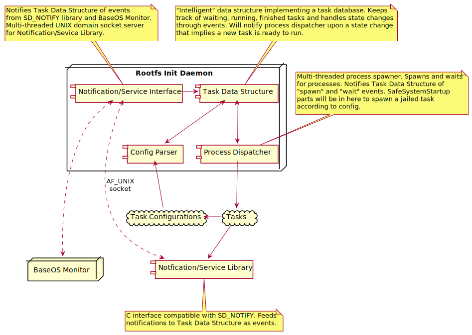

# EB BaseOS Crinit -- Configurable Rootfs Init

## In a Nutshell
Crinit, the Configurable Rootfs Init, is an init daemon executed after the rootfs has been mounted and switched into by
[cominit](https://gitlabintern.emlix.com/elektrobit/base-os/eb-baseos-cominit). It reads a global configuration
("series"-file) either specified on the command line or from `/etc/crinit/default.series`. The series file in turn
specifies further configuration files, each for a task potentially containing a set of commands and depenencies on other
tasks (see [Configuration](#configuration) below for examples).

The specified tasks are then started with as much parallelism as dependencies allow, i.e. tasks without any dependencies
are spawned asap after Crinit has been started. Once a task is spawned, finished, or has failed its dependent tasks are
updated and spawned as necessary.

## Concept
The below diagram shows the overall concept of the finished Crinit.



Not indicated in the diagram are planned cryptographic features of the Config Parser intended to provide
verification/integrity checking of the global and task configurations. For this, each config file will need to include a
signature.

## Current Implementation

The central Task Data Structure (`ebcl_TaskDB` in `taskdb.h`), Config Parser (`confparse.h/.c`), Process Dispatcher
(`procdip.h/.c`), Notification/Service interface (`notiserv.h/.c`, `rtimcmd.h/.c`), Client library
(`crinit-client.h/.c`) have been preliminarily implemented and are functioning. In addition, the implementation contains
a simple encapsulated storage for global options (`globopt.h/.c`), some minimal PID 1 setup code which cannot be
"sourced out" into a task configuration (`minsetup.h/.c`), debug/log output functionality (`logio.h/.c`), a CLI 
control program showcasing the the client API (`crinit-ctl.c`) including `reboot` and `poweroff` functionality. 
For detailed explanations of the inner workings please refer to the Doxygen-generated documentation of the individual
header and source files.

The client API is documented in the Doxygen documentation of `crinit-client.h`. The API is implemented as a shared
library (`libcrinit-client.so`).

Not currently implemented is the SafeSystemStartup-like jailing functionality of the Process Dispatcher, as well as the
cryptographic features of the Config Parser. Also, the Notification and Service interface does not yet support handling
of BaseOS monitor events.

This repository also includes an example application for generating the `/etc/machine-id` file used by `elosd` on boot,
i.e. during `earlysetup.crinit`. See `machine-id-gen.c`. This implementation either uses the value for
`systemd.machine_id` given on the Kernel command line or -- on S32G -- the unique ID burned to on-chip OTP memory. If
the Kernel command line value is set, it always takes precedence and any physical memory OTP reads are omitted. This
means that while the application has special functionality for S32G, it can work on any target as long as the Kernel
command line contains the necessary value.

## Configuration

As described above, Crinit needs a global series-file containing global configuration options as well as a list of task
configurations. Examples for a local demonstration inside the build environment (see [Build
Instructions](#build-instructions) below) are available in `config/test/` and examples for use on the S32G board are
available in `config/s32g/`.

### Example Global Configuration
An example, as used to boot a minimal environment on the S32G board, may look like this:
```
# BaseOS crinit series file, specifying which files to parse

TASKS = earlysetup.crinit check_qemu.crinit network-dhcp.crinit sshd.crinit getty.crinit

TASKDIR = /etc/crinit
DEBUG = NO
FILE_SIGS_NEEDED = NO

SHUTDOWN_GRACE_PERIOD_US = 100000

# not yet implemented
SIG = ""
```
#### Explanation
- **TASKS** -- The task configurations to load. This is a mandatory setting.
- **TASKDIR** -- Where to find the task configurations, will be prepended to the filenames in **TASKS**.
                 This is a mandatory setting.
- **DEBUG** -- If crinit should be verbose in its output. Either `YES` or `NO`. Default: `NO`
- **FILE_SIGS_NEEDED** -- If each task configuration needs its own signature. As signature checking is not yet
  implemented, this is parsed but does nothing. Default: `YES`
- **SHUTDOWN_GRACE_PERIOD_US** -- The amount of microseconds to wait between `SIGTERM` and `SIGKILL` on shutdown/reboot.
                                  Default: 100000
- **SIG** -- The signature of this file. Currently unimplemented and can be left empty.

### Example Task Configuration
The `network-dhcp.crinit` from above looks like this:
```
# DHCP config for S32G board

NAME = network-dhcp

COMMAND[] = /bin/mkdir -p /var/lib/dhcpcd
COMMAND[] = /bin/mount -t tmpfs none /var/lib/dhcpcd
COMMAND[] = /bin/touch /var/lib/dhcpcd/resolv.conf
COMMAND[] = /bin/mount -o bind /var/lib/dhcpcd/resolv.conf /etc/resolv.conf
COMMAND[] = /sbin/ifconfig lo up
COMMAND[] = /sbin/ifconfig lo 127.0.0.1
COMMAND[] = /sbin/dhcpcd -j /var/log/dhcpcd.log eth0


# So we only run if we are on the actual S32G board
DEPENDS = check_qemu:fail earlysetup:wait

RESPAWN = NO
RESPAWN_RETRIES = -1
# features below not yet implemented
EXEC = NO
QM_JAIL = NO
SIG = ""
```
#### Explanation
- **NAME** -- The name given to this task configuration. Relevant if other tasks want to depend on this one. This is a
  mandatory setting.
- **COMMAND[]** -- The commands to be executed in series. Executable paths must be absolute. Execution will stop if
  one of them fails and the whole task will be considered failed. The whole task is considered finished (i.e.
  the `network-dhcp:wait` dependency is fulfilled) if the last command has successfully returned. May also be written
  as a series of **COMMAND[n]** keys. In this case, the indices must form a monotonically increasing (by 1) sequence
  starting at 0. When using the syntax with empty brackets, all commands must be written as consecutive lines. Mixing
  both forms (**[]** and **[n]**) is unsupported and may lead to errors during parsing/loading due to duplicate or
  missing keys. There are a few examples of correct and incorrect usage in the `config/test` directory which are used by
  `ci/demo.sh` to check the parser. At least one `COMMAND` is mandatory.
- **DEPENDS** -- A list of dependencies which need to be fulfilled before this task is considered "ready-to-start".
  Semantics are `<taskname>:{fail,wait,spawn}`, where `spawn` is fulfilled when (the first command of) a task has been
  started, `wait` if it has successfully completed, and `fail` if it has failed somewhere along the way. Here we can see
  this task is only run if and after the `earlysetup` (setup of system directories, etc.) has fully completed and the
  `check_qemu` task has determined we are _not_ running inside the emulator and therefore exited with an error code.
  This is a mandatory setting but may be left empty using `""` which is interpreted as "no dependencies".
  _Not yet implemented:_ Once the interface to the
  [Monitor](https://gitlabintern.emlix.com/elektrobit/base-os/corbos-tools) has been implemented, it will be possible to
  depend on a monitor event by adding `@ebclmon:<event_name>` to `DEPENDS`.
- **RESPAWN** -- If set to `YES`, the task will be restarted on failure or completion. Useful for daemons like `getty`.
  This is a mandatory setting.
- **RESPAWN_RETRIES** -- Number of times a respawned task may fail *in a row* before it is not started again. The
  special value `-1` is interpreted as "unlimited". Default: -1
- **EXEC** -- If set to `YES`, `crinit` will exec into the first `COMMAND` of this task instead of spawning a process.
  This is a mandatory setting. (Not yet implemented.)
- **QM_JAIL** -- If set to `YES`, all `COMMAND`s will be spawned inside a restricted environment such as the non-SIL/QM
  environment created by SafeSystemStartup. This is a mandatory setting. (Not yet implemented.)
- **SIG** -- The signature of this file. Currently unimplemented and can be left empty.

## crinit-ctl Usage Info

`crinit-ctl` is a CLI control program for `crinit` wrapping the client API functionality.

Below is its help output:
```
USAGE: crinit-ctl <ACTION> [OPTIONS] <PARAMETER> [PARAMETERS...]
  where ACTION must be exactly one of (including specific options/parameters):
     addtask [-f/--overwrite] [-i/--ignore-deps] [-d/--override-deps "depA:eventA depB:eventB [...]"] <PATH>
             - Will add a task defined in the task configuration file at <PATH> (absolute) to Crinit's task database.
               '-f/--overwrite' - Lets Crinit know it is fine to overwrite if it has already loaded a task
                    with the same name.
               '-d/--override-deps <dependency-list>' - Will override the DEPENDS field of the config file
                    with what is given as the parameter.
               '-i/--ignore-deps' - Shortcut for '--override-deps ""'.
   addseries [-f/--overwrite] <PATH>
             - Will load a series file from <PATH>. Options set in the new series file take precedence over
               current settings.
               '-f/--overwrite' - Lets Crinit know it is fine to overwrite if it has already loaded tasks
                    with the same name as those in the new series file.
      enable <TASK_NAME>
             - Removes dependency '@ctl:enable' from the dependency list of <TASK_NAME> if it is present.
     disable <TASK_NAME>
             - Adds dependency '@ctl:enable' to the dependency list of <TASK_NAME>.
        stop <TASK_NAME>
             - Sends SIGTERM to the PID of <TASK_NAME> if the PID is currently known.
        kill <TASK_NAME>
             - Sends SIGKILL to the PID of <TASK_NAME> if the PID is currently known.
     restart <TASK_NAME>
             - Resets the status bits of <TASK_NAME> if it is DONE or FAILED.
      status <TASK_NAME>
             - Queries status bits and PID of <TASK_NAME>.
      notify <TASK_NAME> <"SD_NOTIFY_STRING">
             - Will send an sd_notify-style status report to Crinit. Only MAINPID and READY are
               implemented. See the sd_notify documentation for their meaning.
        list
             - Print the list of loaded tasks and their status.
      reboot
             - Will request Crinit to perform a graceful system reboot. crinit-ctl can be symlinked to
               reboot as a shortcut which will invoke this command automatically.
    poweroff
             - Will request Crinit to perform a graceful system reboot. crinit-ctl can be symlinked to
               poweroff as a shortcut which will invoke this command automatically.
  General Options:
        --verbose/-v - Be verbose.
        --help/-h    - Print this help.
        --version/-V - Print version information about crinit-ctl, the crinit-client library,
                       and -- if connection is successful -- the crinit daemon.
```

## Build Instructions
Executing
```
ci/docker-run.sh
```
will start a Docker container with all necessary programs to build Crinit and its Doxygen documentation and to run a
short local demonstration.

Inside the container, it is sufficient to run
```
ci/build.sh
```
which will compile `crinit`, the client library and crinit-ctl for ARM64 and for x86_64 as well as a suite of RPMs. The
doxygen documentation is built as well. The script will copy relevant build artifacts to `result/`.

Afterwards, it is possible to run (also inside the container)
```
ci/demo.sh
```
for a short local demonstration of `crinit`'s client API using `crinit-ctl`.

A `clang-tidy` analysis of the source can be performed using
```
ci/clang-tidy.sh
```
This will also generate a `compile_commands.json`. The output will be saved to `result/clang-tidy`.

Unit tests can be built and run using
```
ci/run-utest.sh
```

If a manual test build is desired, running the following command sequence 
inside the container will setup the build system and build native binaries.
```
mkdir -p build/x86_64
cmake -B build/x86_64 -DCMAKE_BUILD_TYPE=Debug -DCMAKE_VERBOSE_MAKEFILE=On -DUNIT_TESTS=On
make -C build/x86_64
```

The Doxygen documentation alone can be built using
```
make -C build/x86_64 doxygen
```
